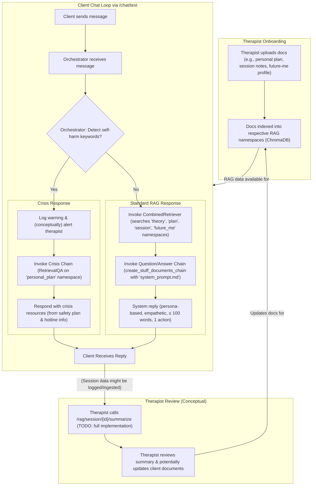

# Dear Future Me

## An AI-driven future-self coaching system for suicide prevention

---

## 📖 Overview

`Dear Future Me` provides a compassionate conversational interface where users chat with an AI persona representing their own positive, thriving future selves. It combines:

| Capability                               | Notes                                                                                                |
| ---------------------------------------- | ---------------------------------------------------------------------------------------------------- |
| **Crisis Detection**                     | Detects self-harm intent and answers with safety-plan snippets + hotlines.                           |
| **Retrieval-Augmented Generation (RAG)** | Utilizes multiple RAG namespaces: `theory`, `personal_plan`, `session_data`, `future_me`.            |
| **Modern LangChain Chains**              | Employs `create_retrieval_chain` and `create_stuff_documents_chain` for efficient RAG.                 |
| **Singleton RagOrchestrator**            | Instantiated once at startup for efficient RAG queries related to session summarization.             |
| **Therapist Co-creation**                | Clinician and client build a *Future-Me Narrative* (stored in `future_me` RAG namespace).            |
| **Session Summarization**                | `/rag/session/{id}/summarize` endpoint (Note: document retrieval for summarization is a TODO).       |
| **Demo Mode & Auth Mode**                | Supports public chat in demo mode and JWT-protected chat in production mode.                         |

---

## 🏗️ Architecture & Flow

### Runtime Flow



---

## 🚀 Quickstart

### Prerequisites

*   Docker
*   Docker Compose (Recommended for running with ChromaDB)
*   Python 3.11+ (for local development without Docker)
*   A valid OpenAI API key.

### Setup `.env`

1.  Clone the repository:
    ```bash
    git clone https://github.com/your-org/dear_future_me.git # Replace with your repo URL
    cd dear_future_me
    ```
2.  Copy the example environment file and configure it:
    ```bash
    cp .env.example .env
    ```
3.  Edit `.env` to set your `SECRET_KEY`, `DATABASE_URL` (if not using the default SQLite), and especially your `OPENAI_API_KEY`.
    *   To generate a `SECRET_KEY`: `python -c "import secrets; print(secrets.token_urlsafe(32))"`

### Option 1: Running with Docker Compose (Recommended)

This starts the FastAPI application and a ChromaDB vector store.

```bash
docker-compose up --build -d
```

### Option 2: Running Locally (without Docker for ChromaDB)

This is suitable if you want to run ChromaDB separately or use an in-memory version for quick tests (requires code changes in `DocumentProcessor` for non-persistent Chroma). The default setup persists Chroma data to `./chroma_data`.

1.  Create and activate a virtual environment:
    ```bash
    python -m venv .venv
    source .venv/bin/activate  # On Windows: .venv\Scripts\activate
    ```
2.  Install dependencies:
    ```bash
    pip install -r requirements.txt
    pip install -r requirements-dev.txt # For linters, testing tools
    ```
3.  Run database migrations (if `DEMO_MODE=false`):
    ```bash
    alembic upgrade head
    ```
4.  Start the FastAPI server:
    ```bash
    uvicorn app.main:app --reload --port 8000
    ```

### Verify Server is Running

```bash
curl http://localhost:8000/ping
# Expected output: {"ping":"pong"}
```

Access the API docs (Swagger UI) at http://localhost:8000/docs.

---

## 🖥️ Quickstart with GUI (Streamlit Web App)

A Streamlit-based web interface is provided for a more user-friendly way to interact with the 'Dear Future Me' chat system. This GUI handles authentication and chat directly in your web browser.

### Prerequisites for Streamlit GUI

* All prerequisites for running the main FastAPI server (Docker/Python, .env configured, etc.).
* The FastAPI server **must be running** for the Streamlit GUI to connect to it.
* Streamlit is included in `requirements.txt`.

### Running the Streamlit GUI

1. **Ensure the FastAPI server is running.** (See 'Quickstart' sections above for Docker or local server setup).
2. **Open a new terminal** in the project root directory.
3. **(If not using Docker for the main app)** Activate your Python virtual environment if you haven't already:

    ```bash
    source .venv/bin/activate  # On Windows: .venv\Scripts\activate
    ```

4. **Run the Streamlit application:**

    ```bash
    streamlit run streamlit_app.py
    ```

5. Streamlit will typically open the web application automatically in your default browser (usually at `http://localhost:8501`). If not, the terminal output will provide the URL.

### Using the Streamlit GUI

1. **Authentication:**
    * When you first open the app, you'll see options to **Login** or **Register** in the sidebar.
    * Enter your email and password.
    * If `DEMO_MODE=true` is set in your project's `.env` file (this influences the *CLI's* default user and the *server's* DB reset behavior), you can use the `DEMO_USER_EMAIL` and `DEMO_USER_PASSWORD` defined in your `.env` file to log in. The Streamlit app will attempt to register this user if it's their first time and then log in.
    * If `DEMO_MODE=false`, you'll need to register a new user first if you haven't already.
    * Upon successful login, your email will be displayed in the sidebar.
2. **Chatting:**
    * Once logged in, the main area of the page will display the chat interface.
    * Type your message in the input box at the bottom and press Enter or click the send icon.
    * The conversation will appear, with your messages and responses from your 'Future Self'.
3. **Language:**
    * The GUI's display language and the language used for LLM prompts are determined by the `APP_DEFAULT_LANGUAGE` setting in your project's `.env` file (e.g., `he` for Hebrew, `en` for English).
4. **Logout:**
    * A 'Logout' button is available in the sidebar to end your session.

---

## 🗣️ Quickstart with CLI (Interacting with the Server)

The `app/cli.py` provides an interactive command-line interface to chat with the running API server. The `/chat/text` endpoint **always requires authentication**.

The CLI will attempt to use the language specified by `APP_DEFAULT_LANGUAGE` in your `.env` file for its interface (defaulting to English if the specified language or strings are not found). For the demo, it's recommended to set `APP_DEFAULT_LANGUAGE=he` for a Hebrew interface.

1. **Ensure the server is running** (either via Docker Compose or locally).
2. **Configure Demo User Credentials & Language (for CLI Demo Mode):**
    * Ensure `DEMO_USER_EMAIL`, `DEMO_USER_PASSWORD`, and `APP_DEFAULT_LANGUAGE` (e.g., `he`) are set in your `.env` file (see `.env.example`).
    * The CLI will use these credentials if the `DEMO_MODE` flag in your `.env` file is set to `true`.
3. **Open a new terminal** in the project root.
4. **(If not using Docker for the CLI)** Activate your virtual environment: `source .venv/bin/activate`
5. **Start the interactive chat**:

    ```bash
    python -m app.cli chat
    ```

    You can also specify the server URL if it's not running on the default `http://localhost:8000`:

    ```bash
    python -m app.cli chat --url http://your-server-address:port
    ```

* **CLI Authentication Behavior (based on `.env`'s `DEMO_MODE`):**
  * If `DEMO_MODE=true` in `.env`: The CLI will attempt to automatically register (if the user doesn't exist) and then log in using the `DEMO_USER_EMAIL` and `DEMO_USER_PASSWORD` from your `.env` file.
  * If `DEMO_MODE=false` in `.env`: The CLI will attempt to register and log in a new, temporary, randomly generated user for the duration of the CLI session.

---

## 🎭 Demo Mode vs. Production Mode (Server Behavior) & Language

The behavior of the server and client tools can be influenced by variables in your `.env` file.

**Server Behavior (based on `.env`'s `DEMO_MODE` when the server starts):**

* **`DEMO_MODE=true` on Server Startup:**
  * The database is reset (tables dropped and recreated) on each application startup. This is useful for ensuring a clean environment for demonstrations.
* **`DEMO_MODE=false` on Server Startup (Production-like):**
  * Database migrations (Alembic) are applied on startup to bring the schema to the latest version, but existing data persists.

**Language Configuration (based on `.env`'s `APP_DEFAULT_LANGUAGE`):**

* The `APP_DEFAULT_LANGUAGE` setting in `.env` (e.g., `he` for Hebrew, `en` for English) determines:
  * The default language for the `app/cli.py` user interface.
  * The language of the LLM prompt templates (`system_prompt.*.md`, `crisis_prompt.*.md`) loaded by the server. This heavily influences the language of the LLM's responses.
  * For the demo, setting `APP_DEFAULT_LANGUAGE=he` is recommended.

**Important Security Note:**
The `/chat/text` API endpoint (and other sensitive endpoints) **always require authentication**, regardless of the server's `DEMO_MODE` setting. This ensures that the API is not publicly exposed without valid credentials.

**CLI Behavior (based on `.env`'s `DEMO_MODE` when the CLI starts):**

* See the "Quickstart with CLI" section above for details on how the CLI uses the `DEMO_MODE` setting from `.env` to determine its authentication strategy (predefined demo user vs. temporary user).

---

## 💾 Managing the RAG Store (ChromaDB)

All vector data is persisted under the directory defined by `CHROMA_DIR` in `app.core.settings.py` (defaults to `./chroma_data` when running locally, or `/data` inside the `web` Docker container, mapped to the `chroma_data` volume).

### Ingesting Demo Data

Sample text files are provided in the `demo_data/` folder. Use the `demo_ingestion.sh` script to ingest them (ensure `CHROMA_DIR` in the script matches your setup if not using Docker Compose defaults):

```bash
./demo_ingestion.sh
```
This script first clears old demo collections from the specified `CHROMA_DIR` and then uses `curl` to call the `/rag/ingest/` endpoint for each demo file.

### Cleaning the RAG Store

*   **To reset all demo data if using `demo_ingestion.sh`**: Simply re-run `./demo_ingestion.sh`.
*   **Manual Cleaning (Local `CHROMA_DIR`)**:
    ```bash
    rm -rf ./chroma_data/*  # Or your configured CHROMA_DIR
    ```
*   **Manual Cleaning (Docker Volume)**: If using the `chroma_data` Docker volume:
    ```bash
    docker-compose down -v # This will stop containers and remove volumes, including chroma_data
    docker-compose up --build -d # Restart (Chroma will start with an empty store)
    # Then re-ingest data
    ```

---

## 🧪 Testing

Ensure you have development dependencies installed (`pip install -r requirements-dev.txt`).

```bash
# Run pytest suite (uses test.db, DEMO_MODE=true by default for tests)
pytest -q
```

---

## 📦 Project Structure (Simplified)

```text
├── app/                # FastAPI application
│   ├── api/            # API endpoint definitions (chat.py, orchestrator.py, rag.py)
│   ├── auth/           # Authentication logic
│   ├── core/           # Core settings and configurations
│   ├── db/             # Database session, models, migrations
+   │   ├── migrations/   # Alembic migration scripts
│   ├── rag/            # RAG processing logic (DocumentProcessor)
│   └── cli.py          # Interactive CLI client
│   └── main.py         # FastAPI app instantiation and main router setup
├── demo_data/          # Sample texts for RAG ingestion
├── templates/          # Prompt templates (system_prompt.md, crisis_prompt.md)
├── tests/              # Pytest suite
├── .env.example        # Example environment file
├── alembic.ini         # Alembic configuration
├── docker-compose.yml  # Docker Compose setup
├── Dockerfile          # Docker build instructions for the app
├── requirements.txt    # Main application dependencies
├── README.md           # This file
```

---

## 🙌 Contributing

1.  Fork the repository.
2.  Create a feature branch (`git checkout -b feature/AmazingFeature`).
3.  Commit your Changes (`git commit -m 'Add some AmazingFeature'`).
4.  Push to the Branch (`git push origin feature/AmazingFeature`).
5.  Open a Pull Request.

---

## 📜 License

MIT © Dear Future Me Team (or your chosen license and holder)

