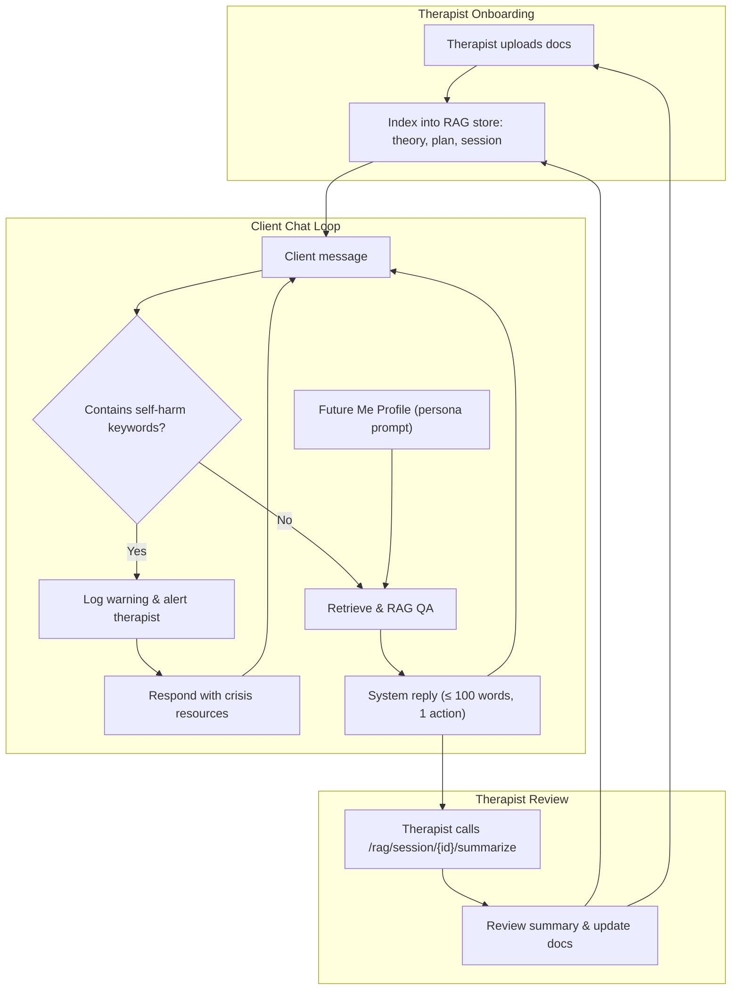

# Dear Future Me

**An AI-driven future-self coaching system for suicide prevention**

---

## 📖 Overview

`Dear Future Me` provides a compassionate conversational interface where users chat with an AI persona representing their own positive, thriving future selves. It combines:

* **Crisis Detection**: Immediate identification of self-harm intent triggers safe fallback and crisis resources.
* **Retrieval-Augmented Generation (RAG)**:  Using four namespaces—`theory`, `personal_plan`, `session_data`, and `future_me`—for context-aware, person-centered responses.
* **Therapist Co-creation**: Therapists and clients collaborate to craft a **Future-Me Narrative**, stored in the `future_me` RAG store.
* **Session Summarization**: Therapists can summarize session history for review and refinement.
* **CLI Demo**: A lightweight command-line interface to showcase functionality offline.

---

## 🏗️ Architecture & Flow

### Runtime Flow



---

## 🚀 Quickstart with Docker

### Prerequisites

* [Docker](https://docs.docker.com/get-docker/)
* [Docker Compose](https://docs.docker.com/compose/)
* A valid OpenAI API key (for production mode)

### Build & Run

```bash
# Clone the repo
git clone https://github.com/your-org/dear_future_me.git
cd dear_future_me

# Copy and configure .env file
cp .env.example .env
# Edit .env to set SECRET_KEY, DATABASE_URL, OPENAI_API_KEY, etc.

# Start services
docker-compose up --build -d

# Check health
curl http://localhost:8000/ping    # {"ping":"pong"}
```

---

## 🎭 Demo Mode (No Auth)

For quick demos without user accounts:

1. In your `.env`, set:

   ```dotenv
   DEMO_MODE=true
   ```

2. Ingest fake demo data (see **Demo Data** below).
3. Chat via CLI or HTTP without login:

   ```bash
   # HTTP chat
   curl -X POST http://localhost:8000/chat/text \
     -H "Content-Type: application/json" \
     -d '{"message":"Hi, I feel stuck."}'

   # CLI demo
   docker exec -it <web_container> python app/cli.py --demo
   ```

---

## 🛠️ Production Mode (With Auth)

1. Ensure `DEMO_MODE=false` or unset.
2. Register and login:

   ```bash
   # Register a new user
   curl -X POST http://localhost:8000/auth/register \
     -H "Content-Type: application/json" \
     -d '{"email":"user@example.com","password":"secret"}'

   # Login to get token
   ```

token=\$(curl -s -X POST [http://localhost:8000/auth/login](http://localhost:8000/auth/login)&#x20;
-F username=[user@example.com](mailto:user@example.com) -F password=secret | jq -r .access\_token)

````
3. Use protected endpoints:
```bash
curl -X POST http://localhost:8000/chat/text \
  -H "Authorization: Bearer $token" \
  -H "Content-Type: application/json" \
  -d '{"message":"Hello!"}'
````

---

## 💾 Managing the RAG Store

All vector data is persisted under the directory defined in `CHROMA_DIR` (default `./chroma_data`).

### Cleaning (Reset All)

```bash
rm -rf ./chroma_data/*
```

### Cleaning One Namespace

```bash
rm -rf ./chroma_data/<namespace>*
```

---

## 📂 Demo Data & Ingestion

Create a `demo_data/` folder with four text files:

```text
demo_data/
├── theory_excerpts.txt
├── personal_plan.txt
├── session_notes.txt
└── future_me_profile.txt
```

**Ingest via HTTP**:

```bash
curl -X POST http://localhost:8000/rag/ingest/ \
  -F namespace=theory         -F doc_id=theory_demo         -F file=@demo_data/theory_excerpts.txt
curl -X POST http://localhost:8000/rag/ingest/ \
  -F namespace=personal_plan  -F doc_id=plan_demo           -F file=@demo_data/personal_plan.txt
curl -X POST http://localhost:8000/rag/ingest/ \
  -F namespace=session_data   -F doc_id=session_demo        -F file=@demo_data/session_notes.txt
curl -X POST http://localhost:8000/rag/ingest/ \
  -F namespace=future_me      -F doc_id=future_demo         -F file=@demo_data/future_me_profile.txt
```

---

## 🧪 Testing

To run the full test suite:

```bash
# Locally (with Python)
pytest -q --disable-warnings

# Inside Docker
docker exec -it <web_container> pytest -q
```

---

## 📦 Project Structure

```text
├── app/                # FastAPI application
│   ├── api/
│   │   ├── chat.py
│   │   ├── orchestrator.py
│   │   └── rag.py
│   ├── auth/
│   ├── core/
│   ├── db/
│   ├── rag/
│   └── cli.py
├── demo_data/          # Sample texts for demo ingestion
├── templates/          # Prompt templates
├── tests/              # Pytest suite
├── docker-compose.yml
├── Dockerfile
├── requirements.txt
└── README.md
```

---

## 🙌 Contributing

1. Fork the repository
2. Create a feature branch
3. Write tests for new functionality
4. Submit a pull request

---

## 📜 License

MIT © dear_future_me
